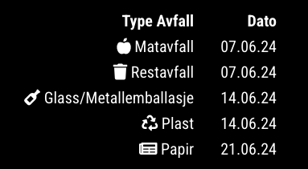

# MMM-Tommekalender
MMM-Tommekalender is a MagicMirror² module that fetches and displays waste collection dates from HIKS. (https://www.hiks.no/privat/tommekalender/)
   
### Screenshot




### Installation

1. Clone the Repository
- Navigate to your MagicMirror's modules directory and clone the module:
   
```
cd ~/MagicMirror/modules
git clone https://github.com/kurtern84/MMM-Tommekalender.git

```
2. Install Dependencies
- Navigate into the module folder and install the necessary dependencies:
```
cd MMM-Tommekalender
npm install
```
3. Add the Module to config.js
- Open your config/config.js file and add the following configuration:
```js
{
    module: "MMM-Tommekalender",
    position: "top_right", // Choose your preferred position
    config: {
        adresse: "Åsvegen 12, Østre Toten", // Your address
        updateInterval: 86400000, // Update interval in milliseconds (default is 24 hours)
        showNextOnly: true, // Show only the next collection date
        icons: {
            "Matavfall": "fas fa-apple-alt",
            "Restavfall": "fas fa-trash",
            "Glass/Metallemballasje": "fas fa-wine-bottle",
            "Plast": "fas fa-recycle",
            "Papir": "fas fa-newspaper"
        }
    }
}
```
4. Add FontAwesome to custom.css
- To use FontAwesome icons, add the following line to your css/custom.css file:
```css
@import url('https://cdnjs.cloudflare.com/ajax/libs/font-awesome/5.15.4/css/all.min.css');
```
5. Start MagicMirror
- Restart your MagicMirror to load the new module:
```
npm start
```

### Configuration Options
|Option|Description|Default|
|------|-----------|-------|
|adresse|Your address for the waste collection calendar.|`"Åsvegen 12, Østre Toten"`|
|updateInterval|How often the module updates in milliseconds.|`"86400000" (24 hours)`|
|showNextOnly|Show only the next collection date..|`"true"`|
|icons|Icons for different types of waste.|`"{...}" (See above)`|

### Support
For issues, please create a GitHub issue in the repository.


